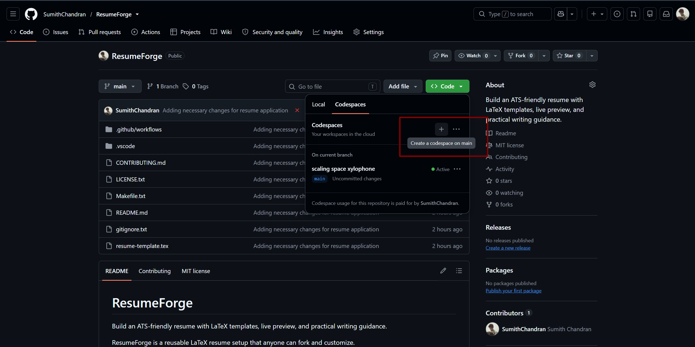
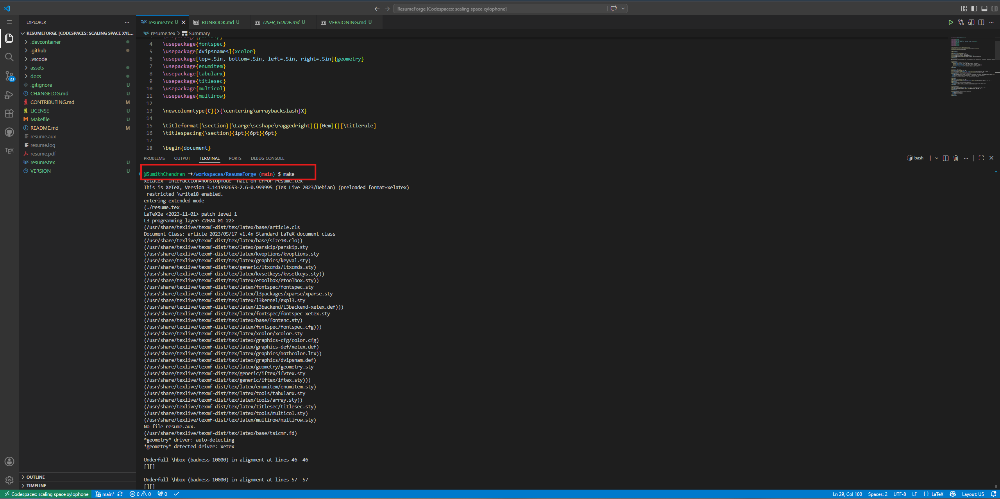
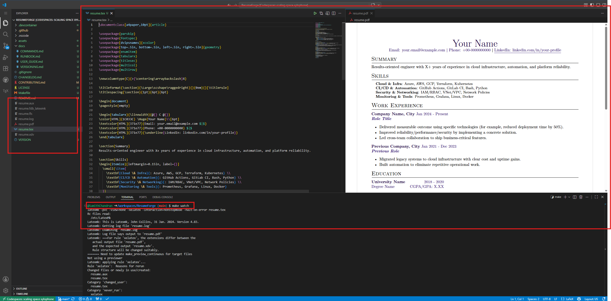
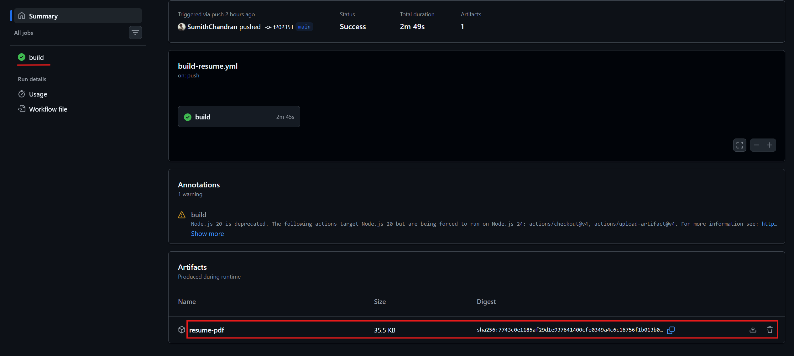

# ResumeForge

Build and maintain an ATS-friendly resume with LaTeX, live preview, and CI validation.

## Start In 2 Minutes

1. Open this repository in a GitHub Codespace.
2. Wait for container setup to finish.
3. Run `make`.
4. Open `resume.pdf`.

## Visual Walkthrough

## Documentation Map

1. User steps: [docs/USER_GUIDE.md](docs/USER_GUIDE.md)
2. Operator runbook: [docs/RUNBOOK.md](docs/RUNBOOK.md)
3. Command quick reference: [docs/COMMANDS.md](docs/COMMANDS.md)
4. Versioning policy: [docs/VERSIONING.md](docs/VERSIONING.md)
5. Contributor guidance: [CONTRIBUTING.md](CONTRIBUTING.md)

## Repository Layout

1. `resume.tex`: source resume file
2. `Makefile`: build, watch, and cleanup targets
3. `.github/workflows/build-resume.yml`: CI pipeline
4. `.devcontainer/`: Codespaces/devcontainer setup
5. `assets/screenshots/`: visual guidance images

## Core Commands

1. Build PDF: `make`
2. Live watch: `make watch`
3. Clean temp files: `make clean`
4. Remove temp files and PDF: `make distclean`

## Local Setup (If Not Using Codespaces)

1. `sudo apt-get update`
2. `sudo apt-get install -y texlive-xetex texlive-fonts-extra latexmk`
3. `make`

## CI Behavior

On push and pull request, CI will:

1. Select a resume source (`resume.tex`, `updated.tex`, or `updated`).
2. Build using `make`.
3. Fail fast if `resume.pdf` is missing.
4. Upload generated PDF artifact.

## Versioning

1. Current version: `1.0.0` (from [VERSION](VERSION)).
2. Changelog: [CHANGELOG.md](CHANGELOG.md).
3. Policy: [docs/VERSIONING.md](docs/VERSIONING.md).

## License

MIT. See [LICENSE](LICENSE).